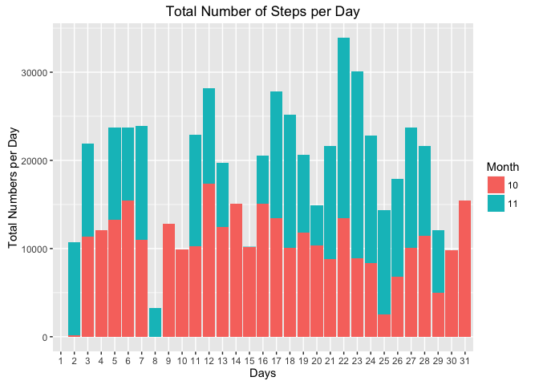
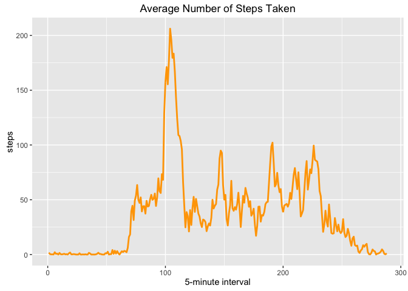
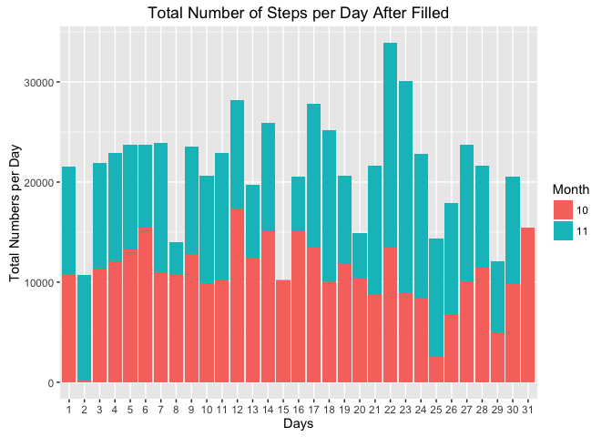
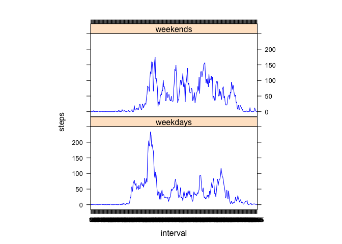

# Reproducible Research: Peer Assessment 1

##Introduction
This assignment makes use of data from a personal activity monitoring device. This device collects data at 5 minute intervals through out the day. The data consists of two months of data from an anonymous individual collected during the months of October and November, 2012 and include the number of steps taken in 5 minute intervals each day.

The data for this assignment can be downloaded from the course web site:

The variables included in this dataset are:
Dataset:  https://d396qusza40orc.cloudfront.net/repdata%2Fdata%2Factivity.zip

The variables included in this dataset are:
steps: Number of steps taking in a 5-minute interval (missing values are coded as 𝙽𝙰)
date: The date on which the measurement was taken in YYYY-MM-DD format
interval: Identifier for the 5-minute interval in which measurement was taken

The dataset is stored in a comma-separated-value (CSV) file and there are a total of 17,568 observations in this dataset.

This report will finish the following tasks:
1.Code for reading in the dataset and/or processing the data
2.Histogram of the total number of steps taken each day
3.Mean and median number of steps taken each day
4.Time series plot of the average number of steps taken
5.The 5-minute interval that, on average, contains the maximum number of steps
6.Code to describe and show a strategy for imputing missing data
7.Histogram of the total number of steps taken each day after missing values are imputed
8.Panel plot comparing the average number of steps taken per 5-minute interval across weekdays and weekends
9.All of the R code needed to reproduce the results (numbers, plots, etc.) in the report


##load the necessary packages for enviorment


```r
library(dplyr)
```

```
## 
## Attaching package: 'dplyr'
```

```
## The following objects are masked from 'package:stats':
## 
##     filter, lag
```

```
## The following objects are masked from 'package:base':
## 
##     intersect, setdiff, setequal, union
```

```r
library(knitr)
library(ggplot2)
library(lattice)
```
##Code for reading in the dataset and/or processing the data
If you need download this dataset, you can delte all the "#" before. Here I read
the data directly from the "activity.csv" in my workdirectory.


```r
#fileurl <- "https://d396qusza40orc.cloudfront.net/repdata%2Fdata%2Factivity.zip"
#download.file(fileurl,destfile = "./act.zip", method = "curl")
#unlink(fileurl)
#unzip(zipfile = "./act.zip")
actData <- read.csv("activity.csv",header = TRUE,colClasses=c("numeric", "character", "numeric"))
```
Tidy the data classess

```r
actData$date <- as.Date(actData$date,"%Y-%m-%d")
actData$interval<- as.factor(actData$interval)
```
##Histogram of the total number of steps taken each day
For this part of the assignment, we ignore the missing values in the dataset.
we use aggregate function to calculate the sum of steps taken each day and then we use 
ggplot function to draw the histogram. Of course, you should first install ggplot2 packages and library () it, if you does not own one.

```r
stepsperday <- aggregate(actData$steps, by= list(actData$date),sum,na.rm = TRUE)

names(stepsperday) <- c("date","steps")

head(stepsperday)
```

```
##         date steps
## 1 2012-10-01     0
## 2 2012-10-02   126
## 3 2012-10-03 11352
## 4 2012-10-04 12116
## 5 2012-10-05 13294
## 6 2012-10-06 15420
```

```r
month <- as.POSIXlt(stepsperday$date)$mon+1

day <- as.POSIXlt(stepsperday$date)$mday

histplot <- ggplot(data= stepsperday,aes(x = factor(day),fill = factor(month), y= steps)) + 
        geom_bar(stat = "identity") +
        labs(title = "Total Number of Steps per Day") + 
        labs(x= "Days",y="Total Numbers per Day") + 
        scale_fill_discrete(name = "Month")

print(histplot)
```

<!-- -->

##Mean and median number of steps taken each day


```r
meanstepsperday <- aggregate(actData$steps, by = list(actData$date),mean,na.rm = TRUE)

names(meanstepsperday) <- c("date","mean")

actData1 <- actData[-which(actData$steps == 0),]

medianstepsperday <- aggregate(actData1$steps, by = list(actData1$date),FUN = median,na.rm = TRUE)

names(medianstepsperday) <- c("date","median")

MMstepsperday <- data.frame(Mean = meanstepsperday$mean,Median = medianstepsperday$median, Date = meanstepsperday$date)

mean1 <- mean(actData$steps,na.rm = TRUE)

median1 <- median(actData1$steps,na.rm = TRUE)

print(MMstepsperday)
```

```
##          Mean Median       Date
## 1         NaN     NA 2012-10-01
## 2   0.4375000   63.0 2012-10-02
## 3  39.4166667   61.0 2012-10-03
## 4  42.0694444   56.5 2012-10-04
## 5  46.1597222   66.0 2012-10-05
## 6  53.5416667   67.0 2012-10-06
## 7  38.2465278   52.5 2012-10-07
## 8         NaN     NA 2012-10-08
## 9  44.4826389   48.0 2012-10-09
## 10 34.3750000   56.5 2012-10-10
## 11 35.7777778   35.0 2012-10-11
## 12 60.3541667   46.0 2012-10-12
## 13 43.1458333   45.5 2012-10-13
## 14 52.4236111   60.5 2012-10-14
## 15 35.2048611   54.0 2012-10-15
## 16 52.3750000   64.0 2012-10-16
## 17 46.7083333   61.5 2012-10-17
## 18 34.9166667   52.5 2012-10-18
## 19 41.0729167   74.0 2012-10-19
## 20 36.0937500   49.0 2012-10-20
## 21 30.6284722   48.0 2012-10-21
## 22 46.7361111   52.0 2012-10-22
## 23 30.9652778   56.0 2012-10-23
## 24 29.0104167   51.5 2012-10-24
## 25  8.6527778   35.0 2012-10-25
## 26 23.5347222   36.5 2012-10-26
## 27 35.1354167   72.0 2012-10-27
## 28 39.7847222   61.0 2012-10-28
## 29 17.4236111   54.5 2012-10-29
## 30 34.0937500   40.0 2012-10-30
## 31 53.5208333   83.5 2012-10-31
## 32        NaN     NA 2012-11-01
## 33 36.8055556   55.5 2012-11-02
## 34 36.7048611   59.0 2012-11-03
## 35        NaN     NA 2012-11-04
## 36 36.2465278   66.0 2012-11-05
## 37 28.9375000   52.0 2012-11-06
## 38 44.7326389   58.0 2012-11-07
## 39 11.1770833   42.5 2012-11-08
## 40        NaN     NA 2012-11-09
## 41        NaN     NA 2012-11-10
## 42 43.7777778   55.0 2012-11-11
## 43 37.3784722   42.0 2012-11-12
## 44 25.4722222   57.0 2012-11-13
## 45        NaN     NA 2012-11-14
## 46  0.1423611   20.5 2012-11-15
## 47 18.8923611   43.0 2012-11-16
## 48 49.7881944   65.5 2012-11-17
## 49 52.4652778   80.0 2012-11-18
## 50 30.6979167   34.0 2012-11-19
## 51 15.5277778   58.0 2012-11-20
## 52 44.3993056   55.0 2012-11-21
## 53 70.9270833   65.0 2012-11-22
## 54 73.5902778  113.0 2012-11-23
## 55 50.2708333   65.5 2012-11-24
## 56 41.0902778   84.0 2012-11-25
## 57 38.7569444   53.0 2012-11-26
## 58 47.3819444   57.0 2012-11-27
## 59 35.3576389   70.0 2012-11-28
## 60 24.4687500   44.5 2012-11-29
## 61        NaN     NA 2012-11-30
```

```r
print(mean1)
```

```
## [1] 37.3826
```

```r
print(median1)
```

```
## [1] 56
```
##Time series plot of the average number of steps taken

Make a time series plot (i.e. type = “l”) of the 5-minute interval (x-axis) and the average number of steps taken, averaged across all days (y-axis)
Aggregate the steps per interval (i.e. 05, 10, 15…) and also calculates the mean for each interval. This calculated mean value is then plotted as a time series.


```r
intervalSteps <- aggregate(actData$steps,by = list(actData$interval),mean, na.rm = TRUE)

names(intervalSteps) <- c("interval", "steps")

intervalSteps$interval <- as.numeric(intervalSteps$interval)

timeplot <- ggplot(intervalSteps,aes(x = interval,y = steps)) +
        geom_line(color = "orange", size = 1) + 
        labs(x="5-minute interval",y= "steps",title="Average Number of Steps Taken")

print(timeplot)
```

<!-- -->

##The 5-minute interval that, on average, contains the maximum number of steps
There are a number of days/intervals where there are missing values (coded as 𝙽𝙰). The presence of missing days may introduce bias into some calculations or summaries of the data.

First, we calculate and report the total number of missing values in the dataset (i.e. the total number of rows with 𝙽𝙰s)


```r
maxInterval <- intervalSteps[which.max(intervalSteps$steps),]

print(maxInterval)
```

```
##     interval    steps
## 104      104 206.1698
```

##Code to describe and show a strategy for imputing missing data

Here,we use the mean/median for that day(yo can try other methods, such as median for that day or 5-minitue interval mean .ect.).Create a new dataset named Mergeddata that is equal to the original dataset but with the missing data filled in


```r
newactData <- actData

newmeansteps <- aggregate(newactData$steps, by = list(newactData$interval),mean, na.rm= TRUE)

names(newmeansteps) <- c("interval","steps")

Mergeddata <- merge(newactData,newmeansteps,by = "interval")

Mergeddata$steps.x[is.na(Mergeddata$steps.x)] <- Mergeddata$steps.y[is.na(Mergeddata$steps.x)]

names(Mergeddata) <- c("interval","steps","date","meanstep")

Mergeddata1 <- Mergeddata[-which(Mergeddata$steps == 0),]

mean2 <- mean(Mergeddata$steps, na.rm=TRUE)

median2 <- median(Mergeddata1$steps,na.rm=TRUE)

print(mean2)
```

```
## [1] 37.3826
```

```r
print(median2)
```

```
## [1] 45.33962
```
Here, we can compare the mean and median with first part. we can find that mean1 is equal to mean2 because that we omit all the NA in both calculate. However, the median2 is smaller than median1 because that we fill all NA's with mean.

##Histogram of the total number of steps taken each day after missing values are imputed
Here, we plot the histogram for the total number of steps taken each day after missing values are imputed:


```r
stepsfilled <- aggregate(Mergeddata$steps,by = list(Mergeddata$date),sum,na.rm=TRUE)

names(stepsfilled) <- c("datef","stepsf")

head(stepsfilled)
```

```
##        datef   stepsf
## 1 2012-10-01 10766.19
## 2 2012-10-02   126.00
## 3 2012-10-03 11352.00
## 4 2012-10-04 12116.00
## 5 2012-10-05 13294.00
## 6 2012-10-06 15420.00
```

```r
monthf <- as.POSIXlt(stepsfilled$datef)$mon+1

dayf <- as.POSIXlt(stepsfilled$datef)$mday


histplotfilled <- ggplot(data= stepsfilled,aes(x = factor(dayf),fill = factor(monthf), y= stepsf)) + 
        geom_bar(stat = "identity") +
        labs(title = "Total Number of Steps per Day After Filled") + 
        labs(x= "Days",y="Total Numbers per Day") + 
        scale_fill_discrete(name = "Month")

print(histplotfilled)
```

<!-- -->

##Panel plot comparing the average number of steps taken per 5-minute interval across 
##weekdays and weekends

Use the dataset with the filled-in missing values for this part.Create a new factor variable in the dataset with two levels – “weekday” and “weekend” indicating whether a given date is a weekday or weekend day.Make a panel plot containing a time series plot (i.e. 𝚝𝚢𝚙𝚎 = "𝚕") of the 5-minute interval (x-axis) and the average number of steps taken, averaged across all weekday days or weekend days (y-axis). 


```r
wdays <- as.POSIXlt(actData$date)$wday

wdaysclass <- rep(0, length(actData$date))

wdaysclass[wdays>=1 & wdays <= 5] <- 1 #weekdays

wdaysclass[wdays ==6 | wdays == 0] <-2 #weekend

dayfactor <- factor(wdaysclass,levels = c(1,2),labels = c("weekdays","weekends"))

newactData$days <- dayfactor

WWstepsmean <- aggregate(steps~interval+days,newactData,mean, na.rm= TRUE)

xyplot(steps ~ interval | factor(days), data = WWstepsmean,aspect = 1/2, type = "l",col = "blue")
```

<!-- -->
